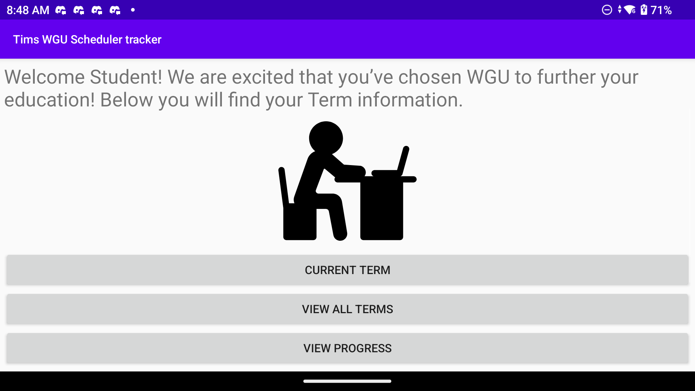
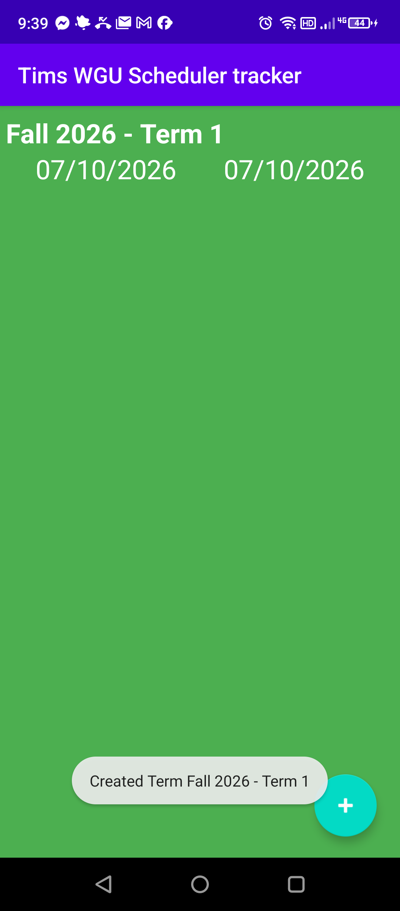
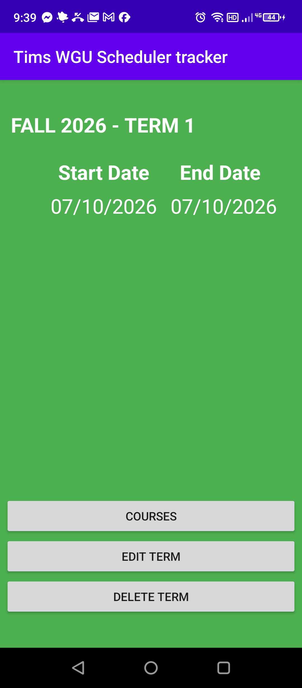
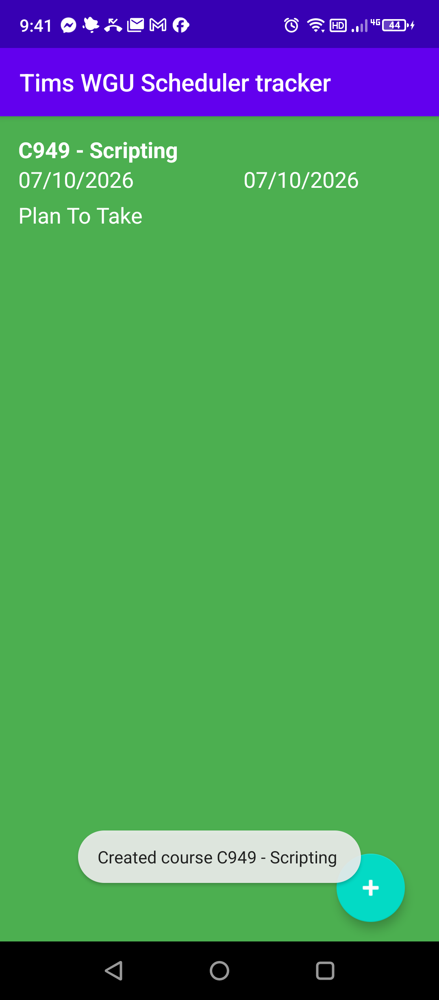

# TimsWGUSchedulertracker

An Android mobile app for tracking WGU (Western Governors University) terms and courses. Helps students manage their degree plan, course progress, and important deadlines.

*The home screen on an Android device — welcome message and navigation to Current Term, All Terms, and Progress.*

### Screens (with data)

| All Terms | Term Detail | Courses |
|---|---|---|
|  |  |  |
| The terms list showing a saved term. | A term's start/end dates and actions. | Courses in a term with status (e.g. "Plan To Take"). |

## Features
- Add and manage academic terms
- Track courses within each term with start/end dates
- Set course status (In Progress, Completed, Dropped, Plan to Take)
- Add assessment due dates and notes
- Local notifications for upcoming deadlines

## Tech Stack
- **Language**: Java
- **Platform**: Android
- **Database**: SQLite (Room)
- **Build**: Gradle / Android Studio

## Getting Started
1. Clone the repo
2. Open in Android Studio
3. Build and run on an emulator or Android device
